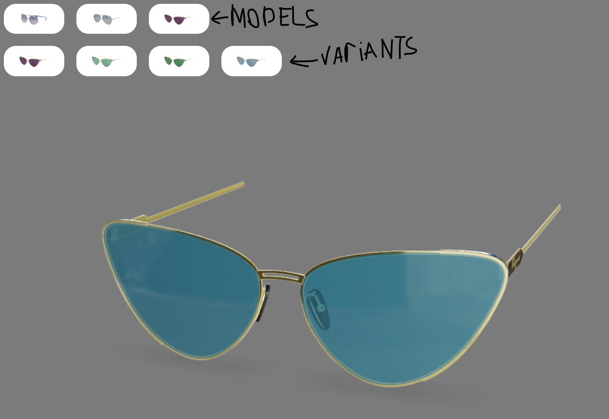
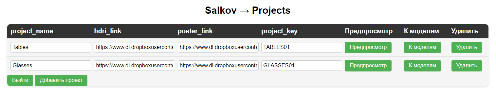
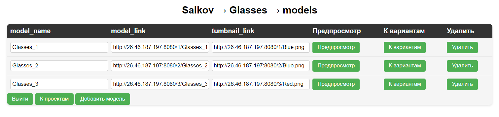
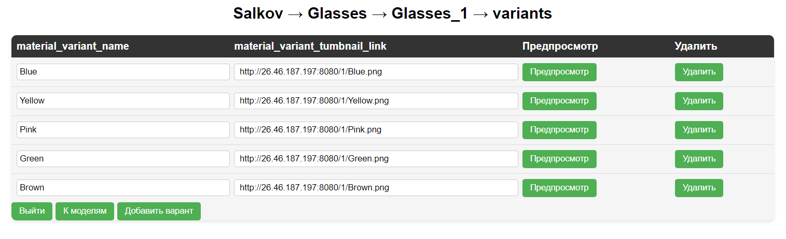

# 3DcoM
3DcoM - это система для размещения и управления 3д контентом в интернете.
С ее помощью, владельцы сайтом могут удобно встравивать и управлять 3д контентом
на своих интернет площадках. 

## Сущности:
**Администратор** - владелец интернет сайта, владеет одним или несколькими **проектами**
**Проект** - контейнер для **моделей**, в интернет магазине может быть категорией товаров
**Модель** - контейнер для **вариантов**, в интернет может быть конкретным товаром
**Вариант** - в интернет вариант может праедставлять собой расцветку какой-то **модели**

Система состоит из двух частей:
1. Клиентская часть (html, css, js)
    `/user`
    Представляет собой окно просмотра зд моделей **проекта** и элементы управления, которые позволяют выбирать **модели** и их **вариант** для отображения в 3д.
    

2. Панель администратора (html, css, js)
    Представляет собой инструмент для управления контентом. Вход в панель администратора 
    осуществляется по уникальнйо для каждого **администратора** паре логин/пароль,
    в панели администратора есть 4 экрана:
    - Экран авторизации администратора - позволяет войти в учетную зваписть **администратора**
    
    - Экран управления **проектами**    
        + Добавление проектов
        + Удаление проектов
        + Переиминовывание проектов
        + Изменение ключа проекта (ключ фактически представляет собой ссылку на проект, встраивается в клиентскую часть)
        + Предпросмотр проекта - позволяет просмотреть все модели и их вариации в проекте, без необходимости публиковать проект на интернет сайте
        
    - Экран управления **моделями**  
        + Добавление моделей
        + Удаление моделей
        + Переиминовывание моделей
        + Предпросмотр моделей
        
    - Экран управления **вариантами**
        + Добавление вариантов
        + Удаление вариантов
        + Переиминовывание вариантов
        + Предпросмотр вариантов
        

3. Серверная часть (node)
    Обрабатывает запросы от клиентской части и панели администратора, делает SQL запросы СУБД

4. СУБД (PostgreSQL)
    Хранит:
    - Учетные данные администраторов
        + Логин, пароль
        + Проекты
    - Проекты
        + Название
        + Ссылка на карту окружения
        + Ссылка на постер
        + Ключ проекта
        + Модели
    - Модели
        + Название
        + Ссылка на jltf модель
        + ссылка на иконку модели
        + Варианты
    - Варианты
        + Название
        + Ссылка на иконку

 ## Описание:

Система 3DcoM включает веб-плеер и инструменты для управления контентом, создана с целью обеспечить эффективное взаимодействие
пользователей и администраторов в контексте электронной коммерции и
веб-дизайна.

Веб-плеер представляет собой 3D-интерактивный инструмент, который
позволяет пользователям просматривать и взаимодействовать с 3D-моделями,
размещенными на сайтах, включая интернет-магазины. Он обеспечивает
удобный и интуитивно понятный интерфейс, позволяющий пользователям
осуществлять манипуляции с моделями, выбирать определенные варианты и
осуществлять покупки.

Инструменты управления контентом, в свою очередь, предоставляют
администраторам возможность управлять своими проектами, добавлять новые
3D-модели, вариации и контент, а также осуществлять удаление ненужных
элементов. Эти инструменты доступны через панель администратора,
обеспечивая удобный интерфейс для управления и контроля контента.
Разработка и представление данной системы имеет важное значение для
современных интернет-магазинов и других сайтов, так как позволяет
предоставить более реалистичный и привлекательный опыт для пользователей
при покупке товаров и представлении продуктов в веб-дизайна. Данная система
является результатом интеграции передовых технологий в области
3D-визуализации, веб-разработки и управления контентом, с целью повысить
конкурентоспособность и эффективность онлайн-платформ.